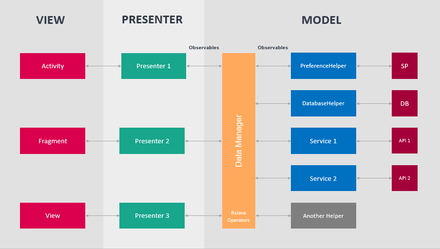

# Boilerplate Kotlin Minimal

Languages, libraries and tools used

- [Kotlin](https://kotlinlang.org/)
- Support libraries
- Dependency Injection with [Dagger 2](http://google.github.io/dagger/)
- [Timber](https://github.com/JakeWharton/timber)

## Requirements

- JDK 1.8
- Android Studio 3
- [Android SDK](http://developer.android.com/sdk/index.html)
- Android Pie [(API 28)](http://developer.android.com/tools/revisions/platforms.html)
- Latest Android SDK Tools and build tools.


## Architecture

This project follows Android architecture guidelines that are based on [MVP (Model View Presenter)](https://en.wikipedia.org/wiki/Model%E2%80%93view%E2%80%93presenter).



## License

```
    Copyright 2019 Dennis Wehrle

    Licensed under the Apache License, Version 2.0 (the "License");
    you may not use this file except in compliance with the License.
    You may obtain a copy of the License at

       http://www.apache.org/licenses/LICENSE-2.0

    Unless required by applicable law or agreed to in writing, software
    distributed under the License is distributed on an "AS IS" BASIS,
    WITHOUT WARRANTIES OR CONDITIONS OF ANY KIND, either express or implied.
    See the License for the specific language governing permissions and
    limitations under the License.
```

## Inspiration & Credits
A special thanks to the authors of these repositories:
* https://github.com/googlesamples/android-architecture
* https://github.com/android10/Android-CleanArchitecture
* https://github.com/bufferapp/android-clean-architecture-boilerplate
* https://github.com/ribot/android-boilerplate